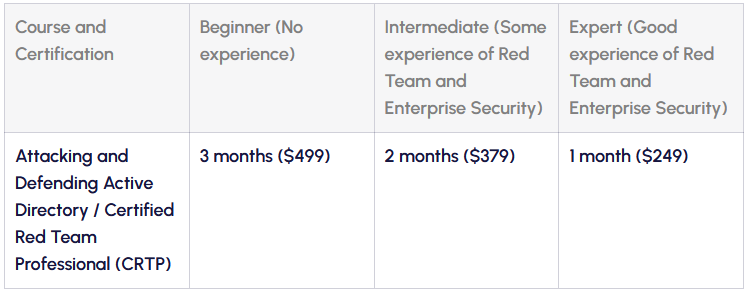
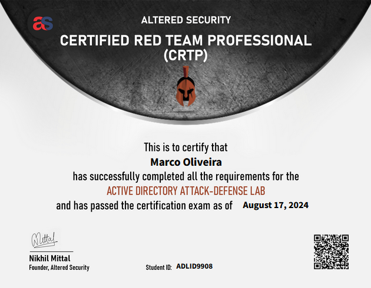

In this blog post you'll find the review for the certification "**Certified Red Team Professional**" by Altered Security.
I'm writting this about 4 months after, a little late but better late than never.

### So what is CRTP?
Certified Red Team Professional, is a certification focused on Active Directory and red teaming techniques, quoting Altered Security: 
>"It is one of the most popular beginner Red Team certification"
It covers topics such as:
- Domain Enumeration
- Privilege Escalation
- Lateral Movement
- Persistence

It costs around 249$ (236€), in my case, I got a discount which got the total cost to 189 euro (30 day lab access).
This price is for the on-demand course, will explain later what it involves, but you also have the more premium option of 299$ (284€) with this you have access to live classes with Nikhil Mattal.  
Cost for the CRTP course:

### Preparation
As I said previously I purchased the 236€ on-demand course. This means you have 90 days access to the course materials from the moment you have access to their platform and then 30 days lab access after starting it.
You don't need to the start the labs as soon as you purchase the course.
With this in mind, I decided to structure my studying the following way, I would go through all the course videos whilst taking notes, and then would go through the lab and try to complete it with just my notes.
I must admit there were times I had to go back to the manual in order to get the flag but it is what it is.

### Exam
Well I started the Exam at around 10am and finished it around 3pm.
Difficulty wise, it is a simple exam, there's no guessing, no cracking and no bruteforcing, everything is sequential and if you have enumeration notes you'll do just fine.
The only time I got stuck was on the third machine which, in hindsight was really easy, I just forgot a simple check on a certain command. (Facepalm moment when I got it).

### Report
The report took longer than I had anticipated, finishing the exam at 3pm I got to work on the report right away, and I only finished it at around 9pm.
In the report I tried to include as many details as I could, I even draw graphs and other diagrams to complete the report.
What I tried to include, for each vulnerability found was:
- Steps on how to reproduce the vulnerability
- Impact
- Remediation

I used an available template online, just searched "Red Team pentest report" and used it as a template. Just use it as a guide, don't go copy pasting thinking you'll be OK.

### Final thoughts and tips

I believe that this exam is very budget friendly, and its price-value is good, definitely worth it for someone looking into getting into the active directory / Red teaming techniques.
Nikhil Mattal is an excelent teacher, explains everything thoroughly and we, as students, can have the sensation that he really does know what he's talking about.

Tips:
- Pay attention during the course videos
- Take notes
- Question everything that you don't understand
- Join their discord

