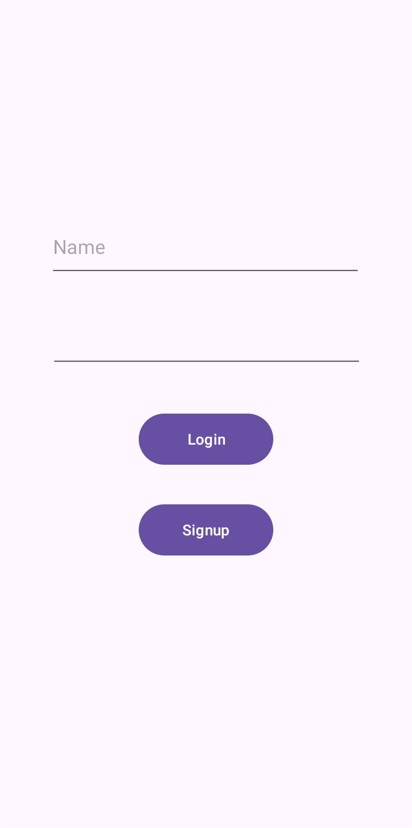
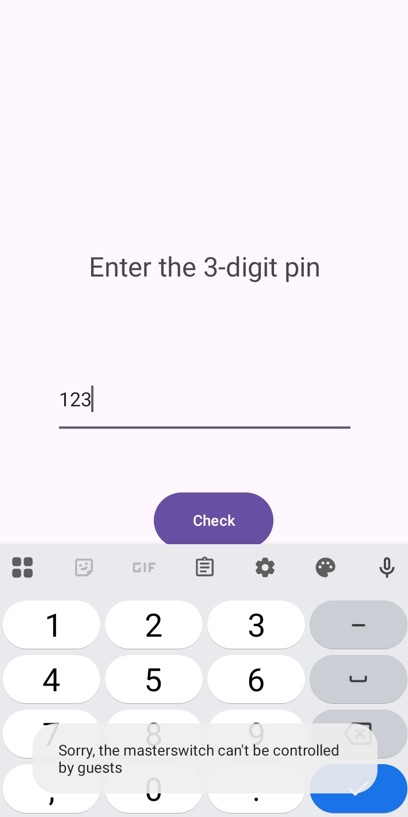

The IOT Connect lab is meant to help you understand how vulnerable **Broadcast receivers** can affect an application's security.

### So what is a Broadcast Receiver?
It's a component, that allows an appplication to listen for and respond to system-wide broadcast messages / events.
Improperly implemented broadcast receivers can allow an attacker to send a malicious intent to make vulnerable applications perform actions not intended for external callers.

### First look at the application
When we open the application we can see a few things.
First we see a login/sign-up, and after sign-in and respective login, we see a few devices, like speakers, TV, Fan, and a button to turn them on and off.
After interacting with them, we see that some we can turn on/off and others we can't, the application tells us its because we are a **guest user**.

  
  

The other thing we see, is a master-switch button that requires a 3 digit pin, interesting.

  
  

