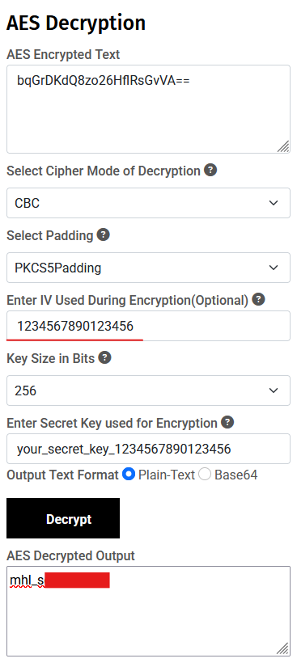

### Introduction
So what is the strings lab? Quoting Mobilehackinglabs:
> Welcome to the Strings Challenge! In this lab,your goal is to find the flag. The flag's format should be "MHL{...}". The challenge will give you a clear idea of how intents and intent filters work on android also you will get a hands-on experience using Frida APIs.


### First Look
<br>
First things first, as always, let's have a look at the application.
<br>
<div style="display: flex; justify-content: center;">
    
</div>
Nothing interesting here, only a default empty activity. Let's move on to static analysis.

### Static Analysis
#### AndroidManifest.xml
<br>

The Manifest file, reveals a second activity "Activity2" with the export attribute set to true.
This activty is waiting on an action `android.intent.action.VIEW` and some data, with scheme `mhl` and host `labs`.

<br>
<div style="display: flex; justify-content: center;">
    
</div>
<br>

#### Activity2

Taking a deeper look into Activity2, we see that this is most likely the "heart of the operation".
On a higher level, we see some decryption happening, some comparisons, and finally we see a `getFlag()`, this appears to be our goal.

<div style="display: flex; justify-content: center;">
    
</div>
<br> 
<br>
Let's break it down in 2 parts.

#### **First Part**

<div style="display: flex; justify-content: center;">
    
</div>

The first highlighted rectangle, is searching for a **shared_preference** named **DAD4**, and inspecting the key named **"UUU0133"** and grabbing its value.
<br>

We then have two `boolean` values, **isActionView** and **isU1Matching**.

**isActionView** checks if the intent has the action `android.intent.action.view`.
 **isU1Matching** checks if the value of `u_1` which contains the value of the shared preference mentioned above, and compares ir to the result of `cd()`.
 <br>

 So what is `cd()`?
 Let's have a look:

<div style="display: flex; justify-content: center;">
    
</div>
<br>

It is a bit confusing, but basically, it returns the current date in the format **dd/MM/yyyy**.

We have enough to wrap this **first part**.
We need to send an intent action with the value mentioned above, and have a file, on the shared_prefs folder of the package with the current date.
<br>

Create `DAD4.xml`, key named `UUU0133` with today's value and place it inside `/data/data/<package>/shared_prefs/`.
This is the contents of said file:
```xml
<?xml version='1.0' encoding='utf-8' standalone='yes' ?>
<map>
	<string name="UUU0133">24/10/2025</string>
</map>
```

#### **Second part**

<div style="display: flex; justify-content: center;">
    
</div>
<br>

Let's go by highlights, the first highlighted line, is checking the intent data, and assigning it to variable `uri`.
The `if` then, checks if the **scheme** received in the intent data is **mhl** and the **host** is **labs**.
<br>

After that, we see that it is getting the last path element, and assigning it and decoding it in `base64`.
<br>

So now we know that we need to send the intent with the following **data**:
`mhl://labs/<base64_encoded_value>`
<br>

The last part of the previous image, we can see that the decoded value of our string is getting compared to a secret and if it is equal to it, than we get to the desired, `getFlag()`.
<br>

Let's see if we can decrypt the content of `bqGrDKdQ8zo26HflRsGvVA==`.
The following tool [AES-DECRYPTION](https://www.devglan.com/online-tools/aes-encryption-decryption) tells us that we need the following information
- Encrypted Text : `bqGrDKdQ8zo26HflRsGvVA==`
- Secret : `your_secret_key_1234567890123456`
- IV : `1234567890123456` (available in the Activity2Kt)
<br>

<div style="display: flex; justify-content: center;">
    
</div>
<br>

Voilá we have its value. **mhl_se(redacted)**
By encoding this value in `base64` we have enough to get the flag.


### Exploiting the vulnerability

Let's start with `adb` calling the activity and sending the action with data the application requires.

```bash
$ adb shell am start "mhl://labs/bWhsX3Nl<redacted>" -a "android.intent.action.VIEW" -c "android.intent.category.DEFAULT" com.mobilehackinglab.challenge/.Activity2
```

After this command line, we see that a new activity is launched with a toast message saying "success". But no flag. Weird, maybe it's in the logs?
<br>

Let's see with pidcat:
<div style="display: flex; justify-content: center;">
    
</div>
<br>

Nothing.. weird, well, time to have a look into the flag library.
Let's open it with ghidra.
<div style="display: flex; justify-content: center;">
    
</div>
<br>

Inspecting the functions we see that almost all of them are doing memory operations, copying values from one place to another. There are obfuscation techniques inplace, but we could most likely get the flag inspecting the memory. Let's try.

To do this, we can do it Fridump or Objection.
#### Using fridump

Using fridump we will dump the memory and check the strings.

```bash
$ python3 fridump.py -U "Strings" -s -o memstring
```
<br>

This will create a file `strings.txt` inside `memstring/` .
Inspecting this file we get the flag:
<div style="display: flex; justify-content: center;">
    
</div>
<br>

#### Using Objection

Using Objection we can search the memory for the flag instead of dumping the whole memory.
<div style="display: flex; justify-content: center;">
    
</div>
<br>
