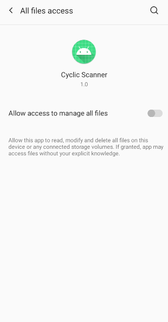
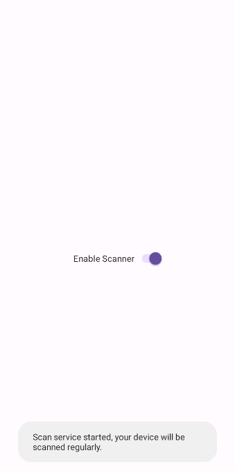
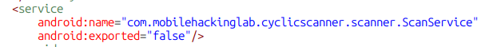
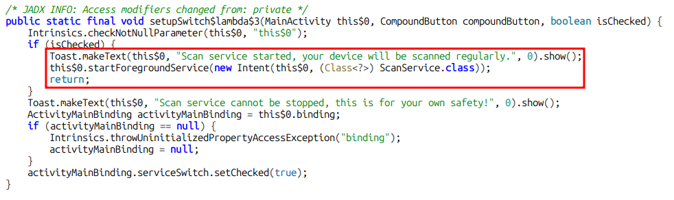
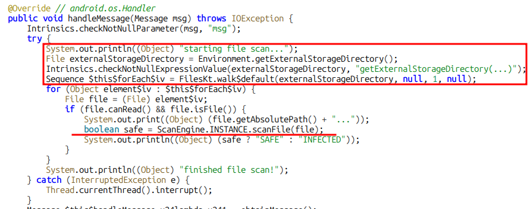
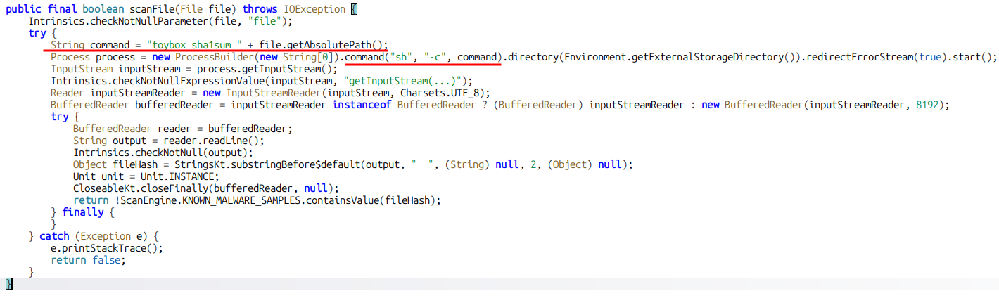
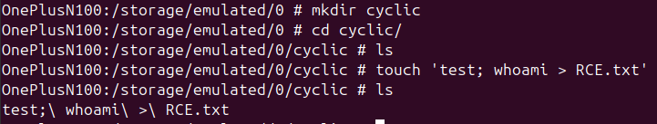
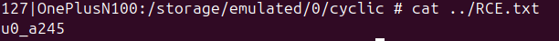

## Introduction

The CyclicScanner lab models practical attack scenarios where defects in Android services can be abused. We will leverage these bugs to gain remote code execution (RCE) on an Android device.

## First Look

As always, we will open and iteract with the application to learn more about it.
 

  
  

 

When we launch the application, we are quickly prompted with a screen to allow storage permissions.
Upon allowing we can get to the application which is a simple switch in the middle of a screen.
After triggering the switch, we get the toast message "Scan Service started".
We can't actually turn this off. Only by shutting the application down.
Let's move on to static analysis to understand what this Scanner is doing.

## Static Analysis

### AndroidManifest.xml

The Manifest file does not reveal too much information. The only interesting bit is this service:
 

    

 

So, this gives us a little more information on where to look. It looks like the service is **not** exported (`android:exported=false`). Therefore we won't be able interact with it with ActivityManager. We'll revisit this service later, but for now, we need to understand what's calling it.

### MainActivity

Looking for references for that switch we find the function '`setupSwitch`' we also see the toast message shown to us earlier. We're on track.
 

    

 

The Highlighted line is starting a background process (`ScanService`), that keeps running even when the app is not in the foreground.
Time to understand what the **ScanService** is doing.

### ScanService

    

 

Going by highlights, the first part prints a string to announce that the file scan is starting, then gets the value of **ExternalStorageFirectory** from the environmental variables.
We then iterate each file in the directory and feed it to the function "scanFile", which seems to be the actual Scan caller. Let's have a look.

### ScanFile()

    

 

The application is concatenating the file's absolute path to the command `toybox sha1sum + file`. We then call process to run this command. So the final command is `sh -c toybox sha1sum /example/file/path/name.txt`.

The rest of the code is basically checking the sha1sum of the scanned file against a list of known malware.

### Exploitation

The vulnerability arises in the file name. Consider the previous example, what if the name of the file is `name.txt; whoami > RCE.txt`?
The final command whould be `sh -c toybox sha1sum /example/file/path/name.txt; whoami > RCE.txt`.
We would successfully achieve Remote Code Execution.

Let's test it.

    

 

In the above image, Im creating a new directory and running the previous example as a PoC.
Our payload will run `whoami` and output it to `RCE.txt`. This will tell us which user is running the app.
 

Upon starting the scan on the application, and by running **pidcat** simultaneously we see that our file was scanned:

    

 

Visiting the base directory will reveal that our file was indeed created, and the command was ran successfully.

    

 