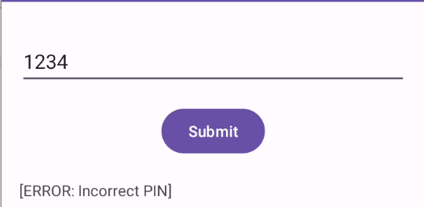
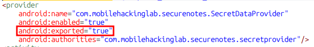
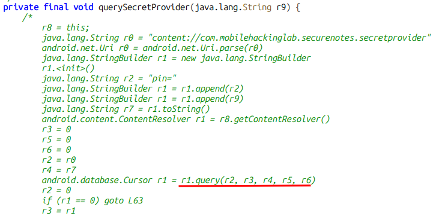
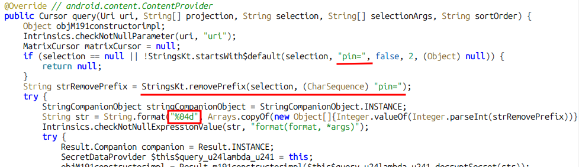
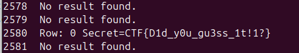

## Introduction

The SecureNotes lab involves an application that has an exported content provider. This specific content provider is a critical service of the application.
By exploiting it we successfully break the application and access privileged information. Let's begin.


## First Look

As always, we will open and iteract with the application to learn more about it.

<br>
<div class="image-row">
  
</div>
<br>

When we launch the application, we see a simple text box in which we can insert a PIN.
Upon inserting a number we get the message "Incorrect Pin" and that's it.
Let's move on.

## Static Analysis

### AndroidManifest.xml

Let have a look at the manifest, I've higlighted below the interesting bit.
There seems to be an exported content provider by the name of "**SecretDataProvider**".

<br>

<div style="display: flex; justify-content: center;">
    
</div>
<br>

What we can also see is the authority for this specific content provider.
It tells us what will be the content uri we will need to query. In this case:
``content://com.mobilehackinglab.securenotes.secretprovider``

### MainActivity

The main activity has an interesting named "``querySecretProvider``", my jadx couldn't decompile the code to java so it's showing the decompiler fallback, this is Dalvik Bytecode, inside a comment block.
Either way, we still get interesting information:
<br>
<div style="display: flex; justify-content: center;">
    
</div>
<br>

We can see that this application is building a PIN string and passing it to the query function.
It also confirms the content uri we need to query mentioned above. 

Let's have a look at the content provider class, in this case "``SecretDataProvider``".

### SecretDataProvider

The query function is where the interesting bit happens.
This is the function that gets called when another app runs:
``contentResolver.query(...)``, so it is the function responsible for defining what data the query will return.

<br>
<div style="display: flex; justify-content: center;">
    
</div>
<br>

I've highlighted the interesting bits. The first bit checks the selection parameter. If it does not start with ``pin=`` then the provider returns **null**.
It is then removing this prefix and storing the number after it, making sure it is of 4 digits, so now we know the pin is between 0000-9999.
With this, we have enough information to brute force it.

### Exploitation

A simple bash one-liner will do the trick here.
```bash
$ for i in {0000...9999}; do echo "$i  `adb shell content query --uri content://com.mobilehackinglab.securenotes.secretprovider --where pin=$i`"; done 
```

Takes a while, but eventually you will see this:

<div style="display: flex; justify-content: center;">
    
</div>
<br>

And with this, we conclude our lab, we got the information we needed by exploiting an exported content provider.

